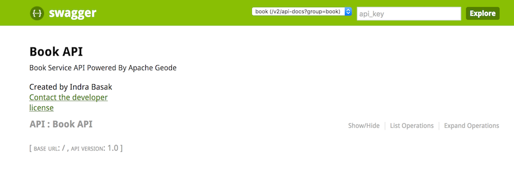

Apache Geode Spring Service Example
=========================================
This is a [**Spring Cloud**](http://projects.spring.io/spring-cloud/) based microservices example backed by
[**Apache Geode**](http://geode.apache.org/) data management platform, Spring Boot, and Spring Data.

### Create a Geode Region
A Geode region is analogous to a database table. It is used for storing and organizing your data in the cluster.

For our `geode-spring-service` example, we will be needing a region named `Book`. Execute the following command at
`gfsh` prompt to create a region a named `Book`:
```
gfsh>create region --name=Book --type=REPLICATE
Member | Status
------ | ----------------------------------
server | Region "/Book" created on "server"
```

### Start the Service
The main entry point `geode-spring-service` example is `com.basaki.example.geode.spring.book.BookApplication` class.
You can either start the application from an IDE by starting the `BookApplication` class.
```
[info 2017/03/08 12:48:25.517 PST <main> tid=0x1] Running in client mode

[info 2017/03/08 12:48:25.672 PST <main> tid=0x1] Pool DEFAULT started with multiuser-authentication=false

[info 2017/03/08 12:48:25.679 PST <poolTimer-DEFAULT-2> tid=0x1e] Updating membership port.  Port changed from 0 to 49,728.  ID is now ibasa-mb-20824(GeodeSpringExampleApplication:56858:loner):0:7e13aeaf:GeodeSpringExampleApplication

2017-03-08 12:48:25.687  INFO 56858 --- [           main] o.s.d.g.client.ClientCacheFactoryBean    : Connected to Distributed System [GeodeSpringExampleApplication] as Member [ibasa-mb-20824(GeodeSpringExampleApplication:56858:loner):49728:7e13aeaf:GeodeSpringExampleApplication]in Group(s) [[]] with Role(s) [[]] on Host [ibasa-mb-20824.ib.com] having PID [56858].
2017-03-08 12:48:25.687  INFO 56858 --- [           main] o.s.d.g.client.ClientCacheFactoryBean    : Created new GemFire v.1.1.0 Cache [GeodeSpringExampleApplication].
[info 2017/03/08 12:48:25.709 PST <main> tid=0x1] Pool gemfirePool started with multiuser-authentication=false

...
6858 --- [           main] o.s.j.e.a.AnnotationMBeanExporter        : Registering beans for JMX exposure on startup
2017-03-08 12:48:27.800  INFO 56858 --- [           main] o.s.c.support.DefaultLifecycleProcessor  : Starting beans in phase 0
2017-03-08 12:48:27.901  INFO 56858 --- [           main] o.s.c.support.DefaultLifecycleProcessor  : Starting beans in phase 2147483647
2017-03-08 12:48:27.902  INFO 56858 --- [           main] d.s.w.p.DocumentationPluginsBootstrapper : Context refreshed
2017-03-08 12:48:27.927  INFO 56858 --- [           main] d.s.w.p.DocumentationPluginsBootstrapper : Found 1 custom documentation plugin(s)
2017-03-08 12:48:27.940  INFO 56858 --- [           main] s.d.s.w.s.ApiListingReferenceScanner     : Scanning for api listing references
2017-03-08 12:48:28.287  INFO 56858 --- [           main] s.b.c.e.t.TomcatEmbeddedServletContainer : Tomcat started on port(s): 8080 (http)
2017-03-08 12:48:28.294  INFO 56858 --- [           main] c.b.e.geode.spring.boot.BookApplication  : Started BookApplication in 8.077 seconds (JVM running for 8.64)
```
The application starts up at port `8080`.

### Accessing Swagger 
On your browser, navigate to `http://localhost:8080/` to view the Swagger. 


Click the `Show/Hide` link to view all the operations exposed by Book API.
* To create a new Book entry, click `POST`. Once expanded 