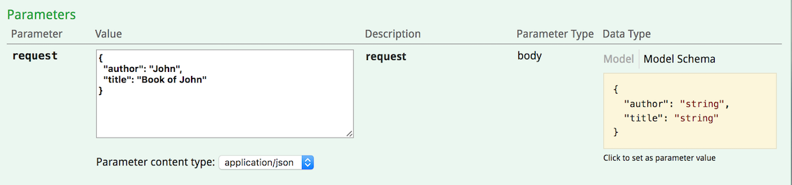
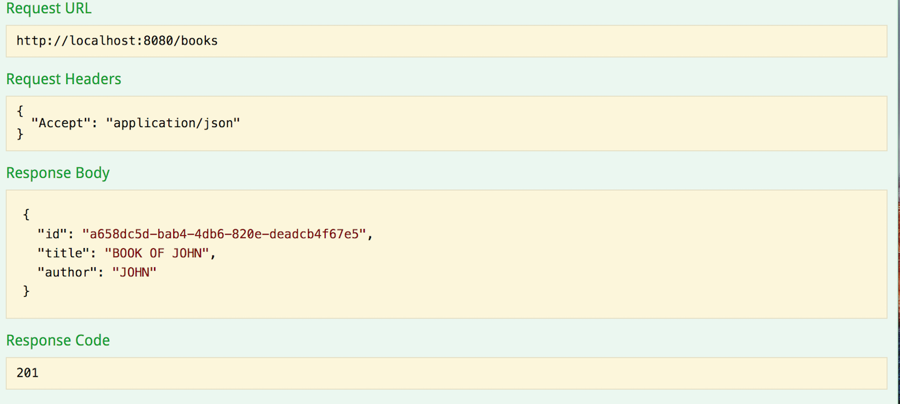
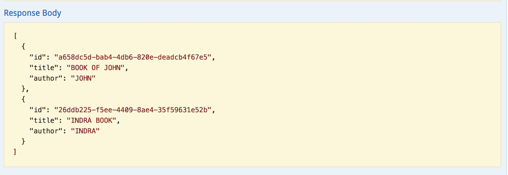

Apache Geode Spring Service Example
=========================================
This is a [**Spring Cloud**](http://projects.spring.io/spring-cloud/) based microservices example backed by
[**Apache Geode**](http://geode.apache.org/) data management platform, Spring Boot, and Spring Data. The data stored in
Geode is serialized using [PDX serializer] (https://cwiki.apache.org/confluence/display/GEODE/PDX+Serialization+Internals).
According to Geode documentation:
"PDX serialization is the preferred serialization format for storing objects in Geode. PDX serialization is designed 
to serialize data as compactly as possible, while still providing the capability to read individual fields in a 
serialized object for query processing."

### Create a Geode Region
A Geode region is analogous to a database table. It is used for storing and organizing your data in the cluster.

For our `geode-spring-service` example, we will be needing a region named `Book`. Execute the following command at
`gfsh` prompt to create a region a named `Book`:
```
gfsh>create region --name=Book --type=REPLICATE
Member | Status
------ | ----------------------------------
server | Region "/Book" created on "server"
```

### Start the Service
The main entry point `geode-spring-service` example is `com.basaki.example.geode.spring.book.BookApplication` class.
You can either start the application from an IDE by starting the `BookApplication` class.
```
[info 2017/03/08 12:48:25.517 PST <main> tid=0x1] Running in client mode

[info 2017/03/08 12:48:25.672 PST <main> tid=0x1] Pool DEFAULT started with multiuser-authentication=false

[info 2017/03/08 12:48:25.679 PST <poolTimer-DEFAULT-2> tid=0x1e] Updating membership port.  Port changed from 0 to 49,728.  ID is now ibasa-mb-20824(GeodeSpringExampleApplication:56858:loner):0:7e13aeaf:GeodeSpringExampleApplication

2017-03-08 12:48:25.687  INFO 56858 --- [           main] o.s.d.g.client.ClientCacheFactoryBean    : Connected to Distributed System [GeodeSpringExampleApplication] as Member [ibasa-mb-20824(GeodeSpringExampleApplication:56858:loner):49728:7e13aeaf:GeodeSpringExampleApplication]in Group(s) [[]] with Role(s) [[]] on Host [ibasa-mb-20824.ib.com] having PID [56858].
2017-03-08 12:48:25.687  INFO 56858 --- [           main] o.s.d.g.client.ClientCacheFactoryBean    : Created new GemFire v.1.1.0 Cache [GeodeSpringExampleApplication].
[info 2017/03/08 12:48:25.709 PST <main> tid=0x1] Pool gemfirePool started with multiuser-authentication=false

...
6858 --- [           main] o.s.j.e.a.AnnotationMBeanExporter        : Registering beans for JMX exposure on startup
2017-03-08 12:48:27.800  INFO 56858 --- [           main] o.s.c.support.DefaultLifecycleProcessor  : Starting beans in phase 0
2017-03-08 12:48:27.901  INFO 56858 --- [           main] o.s.c.support.DefaultLifecycleProcessor  : Starting beans in phase 2147483647
2017-03-08 12:48:27.902  INFO 56858 --- [           main] d.s.w.p.DocumentationPluginsBootstrapper : Context refreshed
2017-03-08 12:48:27.927  INFO 56858 --- [           main] d.s.w.p.DocumentationPluginsBootstrapper : Found 1 custom documentation plugin(s)
2017-03-08 12:48:27.940  INFO 56858 --- [           main] s.d.s.w.s.ApiListingReferenceScanner     : Scanning for api listing references
2017-03-08 12:48:28.287  INFO 56858 --- [           main] s.b.c.e.t.TomcatEmbeddedServletContainer : Tomcat started on port(s): 8080 (http)
2017-03-08 12:48:28.294  INFO 56858 --- [           main] c.b.e.geode.spring.boot.BookApplication  : Started BookApplication in 8.077 seconds (JVM running for 8.64)
```
The application starts up at port `8080`.

### Accessing Swagger 
On your browser, navigate to `http://localhost:8080/` to view the Swagger. 


Click the `Show/Hide` link to view all the operations exposed by Book API.

#### POST Example
Once expanded, create a new Book entry by clicking `POST` and entering the following JSON snippet in the `request` field and click `Try it out!`. 


Here is the response you get back. Please notice the book title and the author gets captitalized before insertion.


#### GET Example
To view all books, click `GET` and click lick `Try it out!`. Here is the response you get back:


### Viewing Data in Geode Shell
Since the data is serialized using PDX serialization, you will get the following error when you execute `query`
command:
```
gfsh>query --query='SELECT * FROM /Book'

Result     : false
startCount : 0
endCount   : 20
Message    : Could not create an instance of a class com.basaki.example.geode.spring.model.Book

NEXT_STEP_NAME : END
```
In order to view PDX serialized data, export the `gfsh-cache.xml` file under the `resources` folder before starting  
`gfsh`
```
export JAVA_ARGS="-Dgeode.cache-xml-file=gfsh-cache.xml"
```
Now you can start the `gfsh`, the `locator`, and the `server`. 
```
gfsh>deploy --jar=/tmp/geode-spring-model-1.0.jar
Member |        Deployed JAR        | Deployed JAR Location
------ | -------------------------- | ------------------------------------------
server | geode-spring-model-1.0.jar | /Users/indra.basak/Software/apache-geode..
```

Query the data again:
```
gfsh>query --query='SELECT * FROM /Book'

Result     : false
startCount : 0
endCount   : 20
Message    : Unknown pdx type=14457433

NEXT_STEP_NAME : END
```